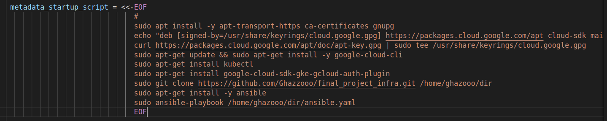

# ITI-DevOps-Final-Project-Infrastructure


## create the infrastructure using terraform to do the following
  * Implement a private GKE Cluster
  * Deploy and configure Jenkins on GKE
  * Deploy the backend application on GKE using the Jenkins pipeline

### Using userdata When The VM Created Will Do : 

  * Install gcloud 
  * Install kubectl
  * Install gcloud plugin
  * Install Ansible
  * Running Ansible playbook



## Create Ansible File to do the following on the cluster:

* Connect to cluster
* create jenkins namespace
* Run jenkins yaml file 


### For Apply The Terraform Code :
```
$ terraform init
$ terraform plan 
$ terraform apply
```


## Then, shh to the VM and connect to the cluster

```
$ gcloud compute ssh --zone "us-east4-a" "private-vm-instance"  --tunnel-through-iap --project "my-project-ghazooo"
```

```
$ gcloud container clusters get-credentials gke-cluster --zone us-east4-b --project my-project-ghazooo
```

### To get Jenkins password:

```
$ kubectl exec --namespace jenkins -it svc/jenkins-service -c jenkins -- /bin/cat /var/jenkins_home/secrets/initialAdminPassword && echo
```

### Get cluster pods and get load balancer external IP :


#### Jenkins now is ready to be used
### Next step: <a href="https://github.com/Ghazzooo/final_project_app/blob/main/README.md" target="_blank">CI/CD in Jenkins</a>


